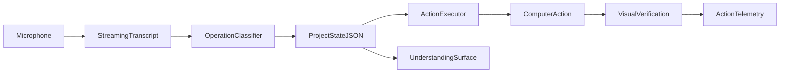

# Pattern: Voice-to-Action Developer Agent

## What this document is

A product requirements document is the shared explanation of what we are
building, why it should exist, what the demo must prove, and how two people can
build it in parallel without creating incompatible halves.

## One-line pitch

Every agent makes you type perfect context and forgets what you meant between
prompts. Pattern listens, preserves, understands, and acts without making you
touch the keyboard.

## Product

Pattern is a voice-native agent for developers. You talk to it the way people
actually talk: messy, stuttering, self-correcting, and jumping between topics.
Pattern preserves every original fragment, resolves each fragment into a
structured operation, and maintains a small live project state containing
goals, tasks, decisions, open questions, and commands.

The action agent reads that state and takes visible computer actions with an
approval gate before anything irreversible and a verification step afterward.
You can interrupt it by voice and redirect it without restarting the whole
task.

Two synchronized surfaces make the intelligence legible:

1. What you are saying and how it changes the project state.
2. What the action agent is planning, doing, and verifying.

## Why this direction

An organizer described five judging dimensions:

1. What value does it provide?
2. What data powers it?
3. What model does it use?
4. How can people understand what is happening in the system?
5. How easy is it to use?

Pattern answers each directly:

### 1. Value

Developers lose intent when they dump unstructured speech into agents, repeat
context across prompts, and reconstruct decisions after interruptions. Pattern
makes imperfect speech usable without throwing away the original thought.

### 2. Data

The primary data is first-party and generated live: the user's utterances, the
derived project state, and the provenance connecting each state change to the
words that caused it. A seeded repository or knowledge base gives the executor
a bounded target for actions.

### 3. Model

The desired final architecture uses:

- streaming speech transcription
- an on-device Gemma-class model for constrained utterance classification
- a planning model for computer actions

The current vertical slice uses a deterministic local classifier behind the
same interface so the state contract and UI can be tested immediately. A local
model can replace it without changing the executor contract. The privacy
position is meaningful: raw, half-formed thoughts remain on the machine; only
approved commands need to touch external systems. The current Chrome speech
recognition spike may process audio remotely, so fully local transcription is
still required before making that privacy claim about the prototype itself.

### 4. System understanding

The live understanding surface shows:

- provisional speech while the user talks
- the complete append-only utterance ledger
- the selected operation and confidence
- active goals, tasks, decisions, and questions
- provenance and revision counts
- queued commands and their approval state

The executor surface shows the current step, model calls, latency, action
results, and visual verification.

### 5. Ease of use

There is no prompt language to learn. The user can stutter, retract, amend, and
interrupt naturally. Cleanup is not a separate editing chore; it is the
interaction model.

## Relationship to HeyClicky

HeyClicky already provides push-to-talk voice, screen context, visual pointing,
and background agents. Pattern should not compete by recreating those features.
It borrows the useful interaction moves and differentiates on durable intent:

- Clicky helps with what is currently on screen.
- Pattern maintains what the user has meant throughout the work.
- Pattern exposes how each fragment changed state.
- Pattern keeps corrections and superseded ideas instead of replacing the
  source transcript with one polished prompt.
- Pattern gives every downstream agent the same inspectable context contract.

This is a valid direction within the voice-and-computer-use wave because its
primary innovation is the memory and control layer, not another cursor overlay.

## Relationship to Chase AI's Agentic OS

Chase AI's useful warning is that a dashboard is only observability. The real
product is a skill architecture that turns repeated work into reliable
automations, with memory underneath it. Pattern follows that architecture:

- the utterance ledger and project state are the memory layer
- command classification suggests a named skill route
- the executor owns the skill implementation and automation
- the two panels expose understanding, action, and proof

The hackathon does not need a complete Agentic OS. It needs one convincing
vertical slice where imperfect speech becomes durable intent, routes into one
real developer skill, executes, and verifies. Visual polish cannot substitute
for that loop.

## Demo sequence

The demo is built around one causal payoff: an action succeeds because Pattern
remembered a correction from earlier.

1. **Ramble.** The user talks for about a minute with stutters, topic jumps, and
   a correction such as: "Actually, use the dark screenshots, not the light
   ones." Live words appear on the left. Goals, tasks, decisions, and questions
   update on the right.
2. **Command.** The user asks Pattern to update a README and draft a hackathon
   post using the downloaded screenshots.
3. **Memory payoff.** The executor chooses the dark screenshots. Pattern
   highlights the exact earlier utterance that caused the choice.
4. **Interrupt.** The user says: "No, keep the installation section. That part
   matters." Pattern updates state and the executor changes course between
   steps.
5. **Approve and verify.** The executor pauses before saving or publishing. The
   user approves by voice. The executor shows a before/after screenshot or file
   diff proving the result.
6. **Export.** Pattern renders a clean project brief that can be handed to
   another agent or teammate.

The safe cut order is:

1. Cut mid-step interruption and keep between-step redirection.
2. Cut the second scripted action.
3. Keep state, provenance, approval, and verification. They are the
   load-bearing proof.

## Shared architecture

The integration boundary is one `ProjectState` contract. The state pipeline
writes it. The executor reads active entities and approved commands, then
updates command execution and verification status. Both halves can be built
against fixtures.

## State contract

Pattern uses two simultaneous representations:

### Lossless source ledger

`utterances[]` is append-only. Every final fragment is preserved, including
retractions and filler. Nothing a user says is destroyed.

### Compact active state

`entities[]` contains the currently useful interpretation:

- goals
- tasks
- decisions
- open questions

Each entity includes:

- stable id
- text
- kind
- active, resolved, or superseded status
- timestamps
- source utterance id
- complete revision history
- replacement link when superseded

`commands[]` contains executable directives, a suggested named skill, approval
status, and links to all active context. `events[]` provides an operation and
telemetry timeline.

## Operation set

Every final utterance maps to one operation:

- `add`: introduce a new state item
- `amend`: add detail to an existing item
- `supersede`: replace active meaning while preserving the previous item
- `resolve`: close a question or task
- `command`: queue an executable directive with context and approval required
- `noise`: preserve the fragment without changing active state

Every operation needs three things:

1. a trigger contract
2. a state mutation contract
3. a validation question

This becomes the evaluation story: build a test set of real messy utterances,
label expected operations and targets, then report classification and
target-selection accuracy.

## Work split

### Ears and memory

Owner: Cole's branch.

- streaming speech and interim transcript
- operation classifier
- lossless utterance ledger
- project state reducer and export
- live understanding surface
- state-operation evaluation set
- shared TypeScript contract

### Hands, eyes, and proof

Owner: executor branch.

- browser or desktop computer control
- two or three rehearsed developer actions
- action telemetry
- approval gates
- before/after verification
- command status updates through the shared contract

The halves are complementary, not competing implementations. They should merge
through the contract rather than be compared as alternative branches.

## Current prototype

The first branch already proves:

- live browser speech transcription in Chrome
- typed fallback for all browsers
- append-only fragment preservation
- six operation types
- correction and provenance handling
- persistent local project state
- approval queue
- JSON and Markdown export
- tests for preservation, supersession, command context, and export

## Scope guards

- One local project state, not lifetime memory.
- Seeded developer tasks, not a general-purpose desktop assistant.
- No autonomous irreversible actions.
- No attempt to rebuild Clicky's cursor overlay.
- No deletion of source utterances.
